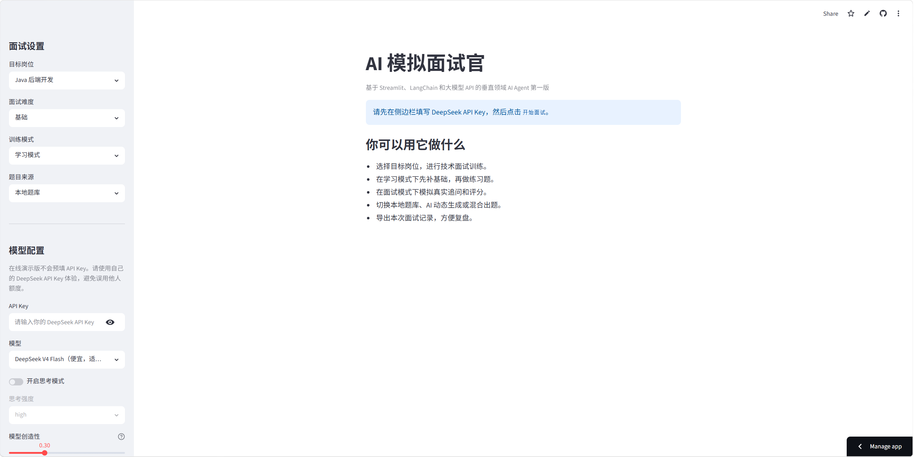
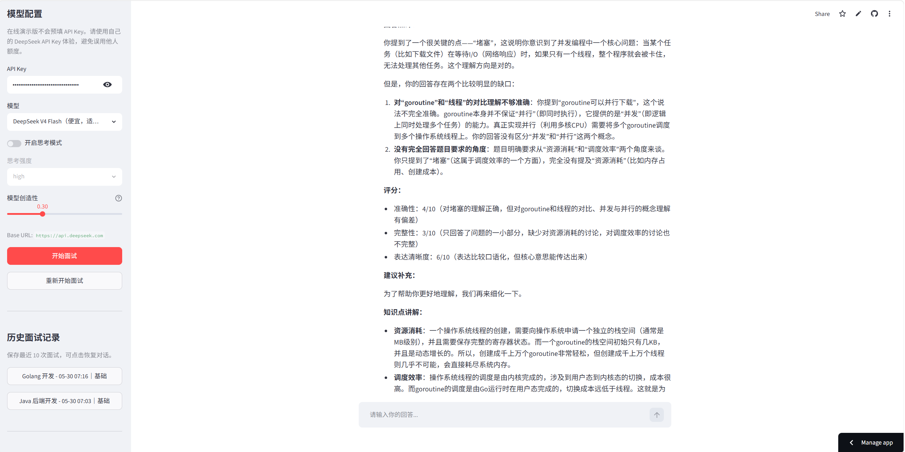
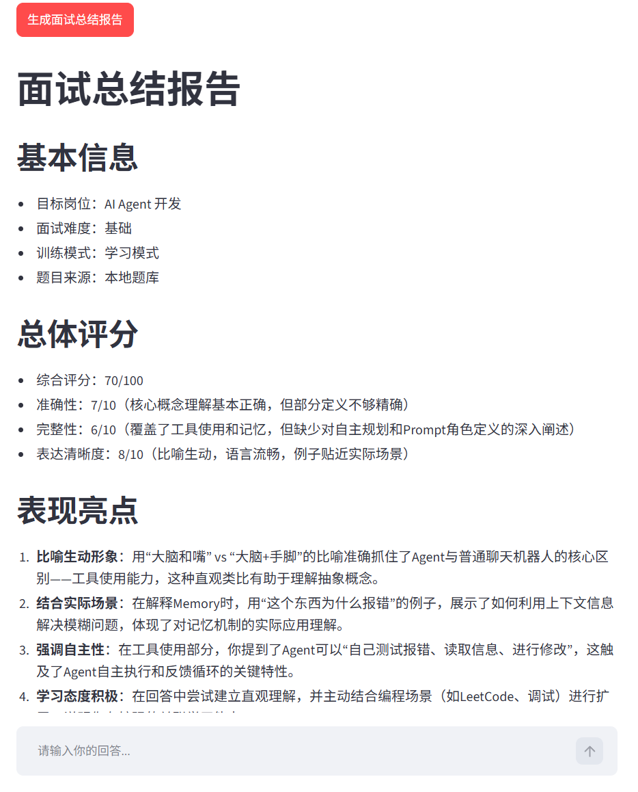
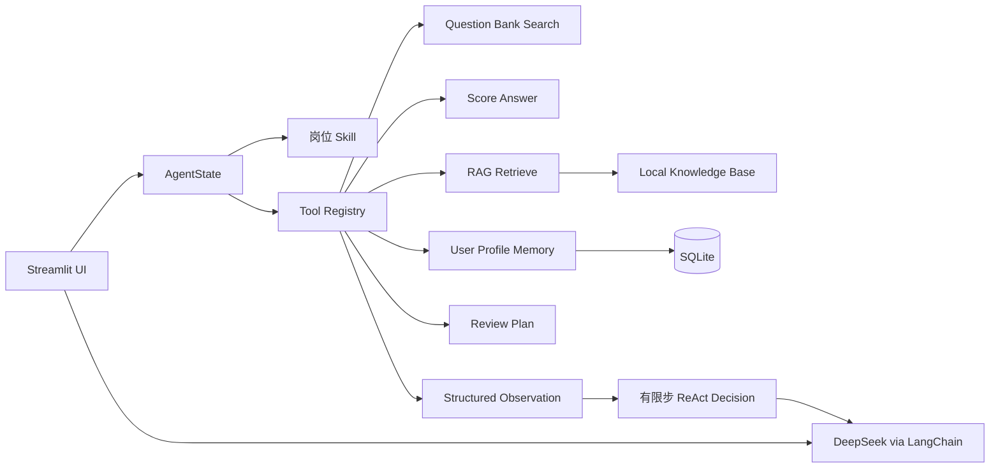

# AI 模拟面试官 Agent

一个基于 Streamlit、LangChain 和 DeepSeek API 的垂直领域 AI Agent 应用，用于模拟技术面试、辅助学习复盘，并生成结构化面试总结报告。

当前版本已从单纯 LLM workflow 升级为轻量 Agent 架构：显式引入 AgentState、Skill、Tool Use、RAG、Memory、有限步 ReAct 和离线 Eval Harness，同时保持 Streamlit 在线演示可直接运行。

- 在线体验：https://ai-interview-agent-8dywxqicugfvm25wglebn6.streamlit.app/
- GitHub：https://github.com/2192635878/ai-interview-agent

> 在线演示版不会内置 API Key。使用时需要在侧边栏输入自己的 DeepSeek API Key，避免公开链接消耗个人额度。

## 项目截图








## 核心功能

- 支持 Java 后端、Python 后端、Golang、前端、算法工程师、AI Agent 等岗位方向。
- 支持学习模式和面试模式，分别面向知识补齐和真实面试训练。
- 支持按岗位加载 Skill 配置，将考察重点、评分 rubric、追问策略和 RAG 标签模块化。
- 支持结构化本地面试题库、AI 动态生成、混合模式三种题目来源。
- 支持本地 Tool Use：题库检索、回答评分、知识检索、用户画像更新和复习计划生成。
- 支持有限步 ReAct：每轮回答后执行“评分工具 -> 画像工具 -> RAG 工具 -> 下一步动作决策”。
- 支持轻量 RAG 检索，从本地面经、JD、学习笔记和题库要点中召回上下文，不依赖额外 embedding 服务。
- 支持长期 Memory，基于 SQLite 保存用户薄弱点、平均分、优势和复习计划。
- 支持题库管理，可上传、预览、下载和恢复结构化 JSON 题库。
- 支持上传 PDF/TXT/MD 简历，AI 可结合项目经历和技能栈生成针对性问题。
- 支持 DeepSeek Flash / Pro 模型切换。
- 支持 DeepSeek 思考模式开关和思考强度选择。
- 支持多轮上下文对话，AI 可根据历史回答继续追问。
- 支持面试题数控制，可选择不限、3 题、5 题或 8 题，并手动换/继续下一题。
- 支持回答质量评分，包括准确性、完整性、表达清晰度。
- 支持历史面试记录保存、恢复、查看和导出。
- 支持生成结构化面试总结报告，包含总体评分、薄弱知识点、改进建议和复习路线。
- 支持离线 Eval Harness，使用 20 条模拟回答验证工具调用、评分 JSON 和弱点识别链路。

## 技术亮点

- 使用 LangChain 的 `ChatOpenAI` 接入 DeepSeek OpenAI 兼容接口，统一管理模型调用。
- 显式设计 `AgentState`，保存当前问题、已问问题、评分历史、薄弱点、优势、下一步动作和工具调用记录。
- 使用岗位 Skill 配置拆分岗位策略，避免把所有规则塞进一个大 prompt。
- 实现本地工具注册表，统一输出 `tool_name/input/observation/confidence/created_at`，便于保存、展示和评测。
- 使用有限步 ReAct 流程控制每轮回答，不做无限循环，兼顾 Agent 展示性和线上稳定性。
- 使用轻量关键词 RAG 检索本地知识库，在无 embedding key 的环境中也能稳定演示。
- 基于 `st.session_state` 保存短期上下文，基于 SQLite 保存长期用户画像。
- 使用 SQLite 持久化保存面试会话、用户回答、AI 回复、AgentState、用户画像和总结报告，并通过浏览器会话标识隔离历史记录。
- 将题库从代码中解耦为 `data/question_bank.json`，按岗位、难度、题型、标签和参考要点组织问题。
- 自定义题库仅保存在当前浏览器会话中，不覆盖默认题库，适合在线演示和多用户访问。
- 设计面试流程控制模块，支持固定题数训练、不限题数加练、主动触发下一题和结束后生成报告。
- 将题目来源抽象为本地题库、LLM 动态生成和混合模式，提升出题灵活性。
- 使用 `pypdf` 解析用户上传的 PDF 简历，并将简历摘要作为上下文注入面试 Prompt。
- 提供 `mcp_server.py` 作为 MCP-ready 工具边界示例，默认主流程仍使用本地工具，避免在线 demo 依赖外部 MCP runtime。
- 提供 `evals/run_eval.py` 离线评测脚本，生成 `evals/eval_report.md`，用于展示 Agent 工程化闭环。
- 对在线演示版的 API Key 做输入校验，避免占位符或中文内容触发请求错误。
- 使用 Streamlit Community Cloud 部署，提供可公开访问的在线演示地址。

## Agent 架构



## 项目结构

```text
ai-interview-agent/
├── app.py                    # Streamlit UI 和交互入口
├── agent/
│   ├── core.py               # Prompt 构建、有限步 ReAct、报告 prompt
│   ├── state.py              # AgentState / ScoreRecord / ToolCallRecord
│   ├── tools.py              # 本地工具注册表和工具实现
│   ├── skills.py             # Skill 配置加载
│   └── memory.py             # SQLite AgentState 和长期用户画像
├── rag/
│   └── retriever.py          # 轻量关键词 RAG 检索
├── data/
│   ├── question_bank.json
│   ├── knowledge_base.json
│   └── skills/
├── evals/
│   ├── sample_answers.json
│   ├── run_eval.py
│   └── eval_report.md
├── tests/
└── mcp_server.py             # MCP-ready 工具边界示例
```

## 技术栈

- Python
- Streamlit
- LangChain
- SQLite
- pypdf
- DeepSeek API

## 本地运行

1. 创建虚拟环境

```bash
python -m venv .venv
```

2. 激活虚拟环境

Windows PowerShell:

```powershell
.\.venv\Scripts\Activate.ps1
```

macOS / Linux:

```bash
source .venv/bin/activate
```

3. 安装依赖

```bash
pip install -r requirements.txt
```

4. 配置环境变量

复制 `.env.example` 为 `.env`，然后填入你的 API Key：

```env
DEEPSEEK_API_KEY=your_deepseek_api_key_here
MODEL_NAME=deepseek-v4-flash
BASE_URL=https://api.deepseek.com
```

5. 启动项目

```bash
streamlit run app.py
```

Windows 用户也可以直接运行：

```powershell
.\run_app.bat
```

## 本地验证

```powershell
.\.venv\Scripts\python.exe -m compileall app.py agent rag evals mcp_server.py tests
.\.venv\Scripts\python.exe -m unittest discover -s tests
.\.venv\Scripts\python.exe evals\run_eval.py
```

运行 eval 后会生成：

```text
evals/eval_report.md
```

## 部署方式

本项目已部署到 Streamlit Community Cloud。

部署步骤：

1. 将项目推送到 GitHub。
2. 在 Streamlit Community Cloud 中选择该仓库。
3. Branch 选择 `main`，入口文件填写 `app.py`。
4. 如需使用服务端 API Key，可在 Secrets 中添加：

```toml
DEEPSEEK_API_KEY = "your_deepseek_api_key_here"
MODEL_NAME = "deepseek-v4-flash"
BASE_URL = "https://api.deepseek.com"
```

当前在线演示版默认要求用户自行输入 API Key。

## 后续规划

- 接入可选向量检索和 rerank，作为当前关键词 RAG 的增强版本。
- 增加题库在线编辑能力，支持新增、修改和删除题目。
- 将 `mcp_server.py` 接入真实 MCP SDK，让题库检索、知识库检索和用户画像查询可被外部 Agent 调用。
- 增加真实 LLM eval，评估重复提问率、追问合理性、评分稳定性和报告可用性。
- 增加 Dockerfile，支持 Zeabur 等平台容器化部署。

## 简历描述示例

基于 Python、LangChain 与 Streamlit 独立开发 AI 模拟面试官 Agent 系统，显式设计 AgentState、岗位 Skill、Tool Use、轻量 RAG、长期 Memory 和有限步 ReAct 流程，支持岗位选择、题库检索、简历解析、回答评分、追问决策、历史画像保存、结构化报告生成和离线 Eval Harness，并部署至 Streamlit Community Cloud 提供在线访问。
